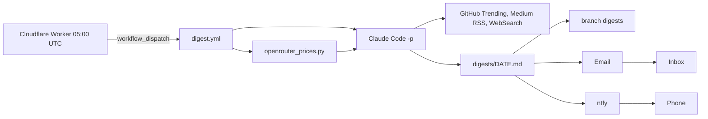

# ai-trends-digest

> Daily AI trends digest: GitHub Actions runs Claude Code headless, then emails
> and pushes the result.

| | |
|---|---|
| Sources | GitHub Trending (daily + weekly), Medium tag feeds, WebSearch, OpenRouter model prices |
| Focus | AI, AI agents, agent harnesses, skills, plugins, MCP, coding agents, model prices |
| Schedule | 05:00 UTC daily, dispatched by [gh-workflow-scheduler](https://github.com/teodorio95-portofolio/gh-workflow-scheduler) |
| Delivery | `digests/YYYY-MM-DD.md` on branch `digests`, email (Gmail SMTP), ntfy push |
| Auth | Claude subscription token (`claude setup-token`), no API billing |

## Secrets

| Secret | What |
|---|---|
| `CLAUDE_CODE_OAUTH_TOKEN` | output of `claude setup-token` |
| `MAIL_USERNAME` | Gmail address, sender and recipient |
| `MAIL_PASSWORD` | Gmail app password (needs 2-Step Verification) |
| `NTFY_TOPIC` | ntfy topic the phone is subscribed to |

Set each with `gh secret set <NAME> -R teodorio95-portofolio/ai-trends-digest`
(it prompts without echoing). Run by hand: `gh workflow run digest.yml -f force=true`.

## Layout

- `.github/workflows/digest.yml` — the whole pipeline; Claude Code only writes
  the Markdown file, commit/email/push are plain workflow steps.
- `prompt/digest.md` — the instructions Claude Code gets (`{{TODAY}}` and
  `{{OPENROUTER}}` are filled in by the workflow).
- `scripts/openrouter_prices.py` — stdlib-only; snapshots OpenRouter prices to
  `data/openrouter-models.json` and prints price drops, per-provider discounts,
  new/free models, ending free offers and retired models.
- `scripts/ntfy_payload.py` — TL;DR as the push text, a tap opens GitHub.
- `tests/` — `uv run --no-project --with pytest pytest -q tests`.
- Branch `digests` — one Markdown file per day plus the price snapshot; the
  agent reads the last 7 days to report only what is new.

> ⚠️ OpenRouter's `/models` always reports `discount: 0`; real discounts are per
> provider on `/models/{id}/endpoints`. ntfy.sh rate-limits per sending IP, so
> a 429 is tolerated and email is the reliable channel.
