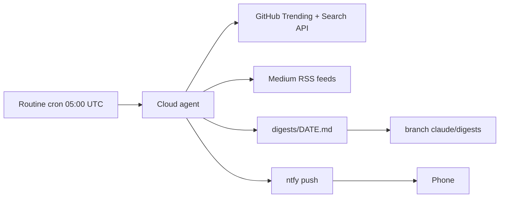

# ai-trends-digest

> Daily AI trends digest, written by a scheduled Claude Code cloud routine.

| | |
|---|---|
| Sources | GitHub Trending (daily), GitHub Search (new repos), Medium tag feeds |
| Focus | AI, AI agents, agent harnesses, skills, plugins, MCP, coding agents |
| Schedule | 05:00 UTC daily (08:00 Bucharest in summer, 07:00 in winter) |
| Delivery | `digests/YYYY-MM-DD.md` on branch `claude/digests` + ntfy push with a link |

## Layout

- `digests/` — one Markdown file per day; the agent reads the previous ones to
  mark what is genuinely new.

> ⚠️ The digest lives on the `claude/digests` branch, not `main`: cloud routines
> push only to `claude/*` branches by default. The ntfy topic is in the routine
> prompt on claude.ai and in the local git-ignored `.env`.
